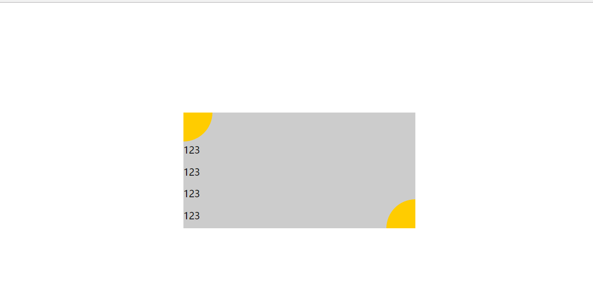
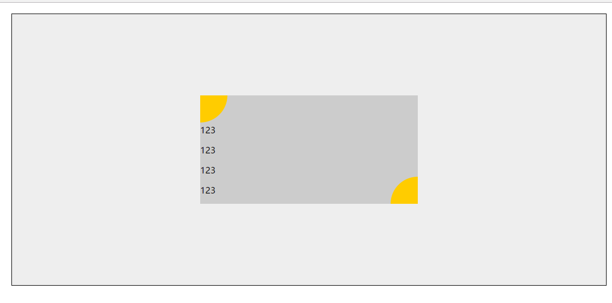
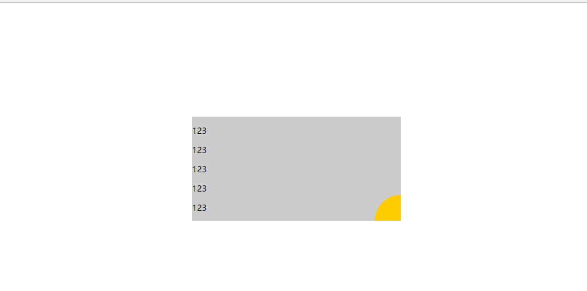
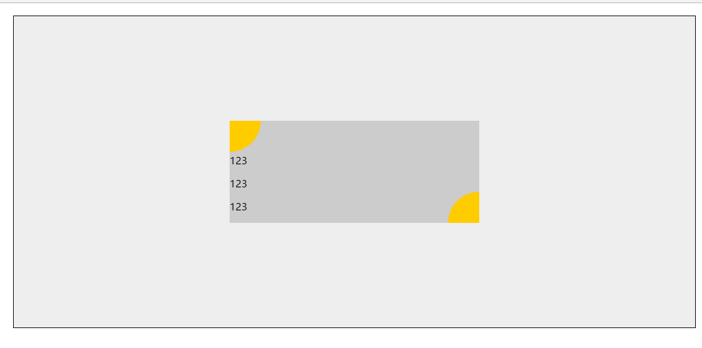

# 任务四：定位和居中

四种思路：

- 对矩形使用`position: absolute`。居中方法是`top: 50%`、`left: 50%`使矩形的左上顶点位于可视区的中心点，再使用`margin-top: -100px`、`margin-left: -200px`使矩形在可视区水平和垂直居中。
	- 条件：矩形的宽度和高度已知且固定
	- 表现：改变浏览器窗口始终居中（此时父容器是浏览器），改变矩形高度不居中
	- 不足：如果矩形高度改变，则不会垂直居中
	
    
- 在矩形外加一个容器`parent`，对矩形使用`position: relative`。居中方法是`margin: 0 auto;`、`top: calc(50% - 100px);`。
	- 条件：外围容器`parent`高度已知
	- 表现：改变浏览器窗口始终居中（相对容器），改变矩形高度不居中
	
    
- 对矩形使用`position: absolute`。居中方法是`top: 50%`、`left: 50%`使矩形的左上顶点位于可视区的中心点，再使用`transform: translate(-50%, -50%);`使矩形在可视区水平和垂直居中。
	- 表现：改变浏览器窗口始终居中（此时父容器是浏览器），改变矩形高度也居中
	
    
- 在矩形外加一个容器`parent`，对`parent`使用`display: flex;`，设置项目对齐方式`justify-content: center;`、`align-items: center;`
	- 表现：改变浏览器窗口始终居中（相对容器），改变矩形高度也居中
	
